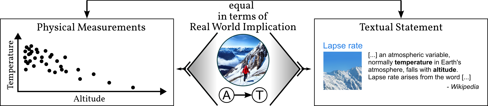

# Causal Parrots: Large Language Models May Talk Causality But Are Not Causal

**Abstract**
Some argue scale is all what is needed to achieve AI, covering even causal models. We make it clear that large language models (LLMs) cannot be causal and give reason onto why sometimes we might feel otherwise. To this end, we define and exemplify a new subgroup of Structural Causal Model (SCM) that we call meta SCM which encode causal facts about other SCM within their variables. We conjecture that in the cases where LLM succeed in doing causal inference, underlying was a respective meta SCM that exposed correlations between causal facts in natural language on whose data the LLM was ultimately trained. If our hypothesis holds true, then this would imply that LLMs are like parrots in that they simply recite the causal knowledge embedded in the data. Our empirical analysis provides favoring evidence that current LLMs are even weak `causal parrots.'



# Instructions
```
conda create -n fm python=3.8
conda install pytorch torchvision torchaudio cudatoolkit=11.3 -c pytorch
pip install numpy, matplotlib, rtpt
pip install wrapt, transformers, openai, aleph_alpha_client
```

0. Create an openAI and aleph-alpha account and store your keys in a file under `./keys/openai` and `./keys/aleph_alpha`.
1. Generate queries. Write/modify and run: `./generate_DATASET.py`
   1. Queries are stored in the `queries/` folder. `dataset_questions.txt` contains a human readable form. `dataset_full.pkl` contains meta information about the used template and variables.
   2. Note: The order of the queries is assumed to be unchanged throughout the process.
2. Adjust `active_apis` and `datasets` variables in `./query_questions.py`. The script will query all specified datasets from all given APIs.
   1. The OPT-30B model needs ~65GB of GPU RAM. Default download dir: `~/.cache/huggingface/`. (Loading the model into memory may take up to 15 minutes).
   2. Responses are stored under `./queries/API_DATASET/IDX.txt`.
   3. Already recorded queries are skipped on rerunning the script.
3. Classify the answers using `add_summary.py`. Again adjust `from_apis` and `datasets` and run the script.
   1. The script auto classifies answers starting with 'yes' or 'no' (auto-classified classes: 'y', 'n', 'uqy', 'uqn').
   2. For all other answers the intention has to be entered manually.
   3. Once all answers of a dataset are classifier a `summary.txt` is written to the dataset folder.
   4. Have a look at the bottom of the script (line 95) for explanations of the different categories.
   5. The auto classification classifies with .
   6. For plotting all 'yes' ('y', 'ye', 'yo', ...), 'no' ('n', 'ne', ..) and 'undefined/uncertain' ('u', 'x', ...) answers will be grouped together for visualization.
4. Run one of the `present_*.py` scripts to create the plots.
   * Results are stored under `./evaluations/`.
   * `present_base_graphs.py` - Visualizes all positive ('yes') edges grouped by API and question template.
   * `present_stability_graphs.py` - Counts the number of predicted edges when altering the question template.
   * `present_wording_stability_graphs.py` - Displays the differences in connectivity when changing variable wordings.
   * `present_common_datasets.py` - Stores queries and answers into a single json file.
5. CCF experiments are stored in the `embeddings` folder.
